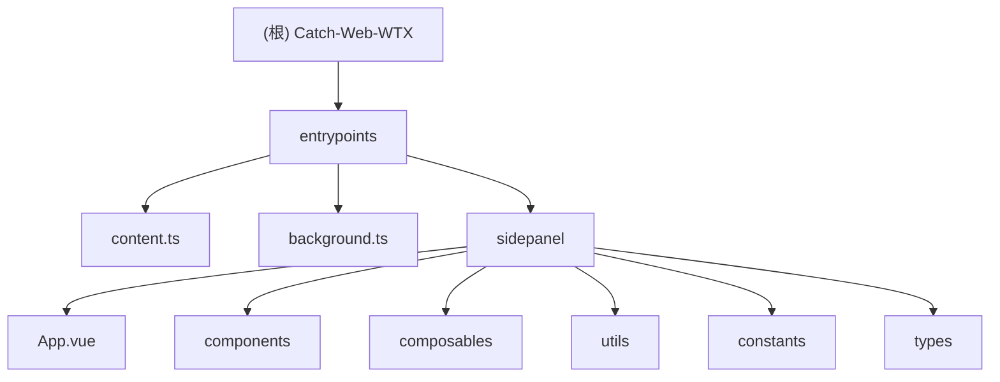

# Catch-Web-WTX 项目文档

## 变更记录 (Changelog)

- 2025-09-18: 初始化项目AI上下文文档

## 项目愿景

Catch-Web-WTX 是一个基于 WXT 和 Vue 3 开发的浏览器扩展，旨在帮助用户高效地提取网页信息、生成AI总结并进行智能对话。该工具可以提取网页的文本、图片、链接等信息，并利用AI技术生成内容摘要和关键信息提取，同时提供基于网页内容的智能对话功能。

## 架构总览

该项目采用浏览器扩展架构，基于 WXT 框架开发，使用 Vue 3 作为前端框架。项目主要包含以下几个核心模块：

1. **数据提取模块** - 负责从当前浏览页面提取各种信息
2. **AI总结模块** - 利用AI技术生成网页内容的总结和关键信息
3. **智能对话模块** - 基于网页内容和AI模型进行智能对话
4. **设置管理模块** - 管理用户配置和扩展设置
5. **UI组件模块** - 提供用户界面组件



## 模块索引

| 模块路径 | 一句话职责 |
|---------|-----------|
| entrypoints/sidepanel | 提供用户界面和核心功能实现 |
| entrypoints/sidepanel/components | UI组件库 |
| entrypoints/sidepanel/composables | 核心业务逻辑封装 |
| entrypoints/content.ts | 内容脚本，负责与页面交互 |
| entrypoints/background.ts | 后台脚本，处理扩展核心逻辑 |

## 运行与开发

### 开发环境准备

1. 确保已安装 Node.js (推荐版本 16+)
2. 安装 pnpm: `npm install -g pnpm`

### 安装依赖

```bash
pnpm install
```

### 开发模式运行

```bash
# Chrome/Edge
pnpm dev

# Firefox
pnpm dev:firefox
```

### 构建生产版本

```bash
# Chrome/Edge
pnpm build

# Firefox
pnpm build:firefox
```

### 打包扩展

```bash
# Chrome/Edge
pnpm zip

# Firefox
pnpm zip:firefox
```

## 测试策略

目前项目未包含自动化测试，建议添加以下测试：

1. 单元测试：针对各 composables 中的核心逻辑
2. 组件测试：测试各 Vue 组件的渲染和交互
3. 端到端测试：模拟用户操作测试完整功能流程

## 编码规范

1. 使用 TypeScript 进行开发
2. 遵循 Vue 3 Composition API 模式
3. 使用 WXT 框架的最佳实践
4. 组件和逻辑分离，使用 composables 管理业务逻辑
5. 使用 ESLint 和 Prettier 保证代码风格一致

## AI 使用指引

本项目集成了AI功能，主要包括：

1. **AI内容总结** - 对提取的网页内容进行总结
2. **关键信息提取** - 从网页内容中提取关键信息
3. **智能对话** - 基于网页内容与用户进行对话

AI功能依赖于OpenAI兼容的API接口，默认配置使用阿里云百炼平台的qwen-turbo模型。

使用AI功能需要：
1. 在设置中配置API密钥
2. 确保网络连接正常
3. 遵守API提供商的使用条款和限制