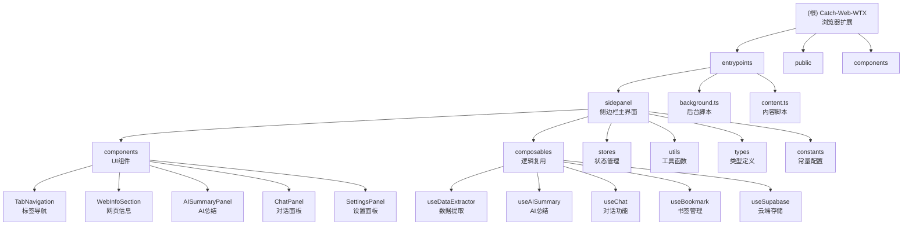

# Catch-Web-WTX 项目文档

> 最后更新：2025-12-27T07:25:01Z

---

## 变更记录 (Changelog)

### 2025-12-27
- 初始化项目架构文档
- 完成全仓扫描与模块识别
- 生成根级与模块级文档

---

## 项目愿景

**Catch-Web-WTX** 是一个基于 Web 技术的浏览器扩展，用于智能提取和分析网页内容。主要功能包括：

- **网页数据提取**：从当前页面提取 HTML、文本、图片、链接、元数据、样式、脚本和文章内容
- **AI 智能总结**：集成 OpenAI API（兼容阿里云等），提供全文总结和关键信息提取
- **数据持久化**：支持本地存储和 Supabase 云端存储
- **书签管理**：将提取的数据保存为书签
- **数据导出**：支持导出提取的数据

### 目标用户
- 研究人员需要快速提取和总结网页内容
- 内容创作者需要收集和整理网络资源
- 数据分析师需要批量获取网页结构化数据

---

## 架构总览

### 技术栈

#### 前端框架
- **Vue 3**：渐进式 JavaScript 框架，使用 Composition API
- **TypeScript**：类型安全的 JavaScript 超集
- **WXT**：现代浏览器扩展开发框架（基于 Vite）

#### UI 与样式
- 纯 CSS 变量系统（支持亮色/暗色主题）
- 响应式侧边栏布局
- Markdown 渲染（使用 marked 库）

#### 状态管理
- Vue 3 Reactivity API
- 自定义 Stores（dataStore、settingsStore、uiStore）

#### 后端集成
- **OpenAI SDK**：AI 总结功能
- **Supabase JS**：云端数据存储
- **Chrome Extension API**：浏览器扩展能力

#### 开发工具
- **Vite**：快速构建工具
- **vue-tsc**：TypeScript 类型检查
- **pnpm**：高效的包管理器

---

## 模块结构图


```mermaid
graph TD
    A["(根) Catch-Web-WTX<br/>浏览器扩展"] --> B["entrypoints"];
    A --> C["public"];
    A --> D["components"];

    B --> E["sidepanel<br/>侧边栏主界面"];
    B --> F["background.ts<br/>后台脚本"];
    B --> G["content.ts<br/>内容脚本"];

    E --> H["components<br/>UI组件"];
    E --> I["composables<br/>逻辑复用"];
    E --> J["stores<br/>状态管理"];
    E --> K["utils<br/>工具函数"];
    E --> L["types<br/>类型定义"];
    E --> M["constants<br/>常量配置"];

    H --> N["TabNavigation<br/>标签导航"];
    H --> O["WebInfoSection<br/>网页信息"];
    H --> P["AISummaryPanel<br/>AI总结"];
    H --> Q["ChatPanel<br/>对话面板"];
    H --> R["SettingsPanel<br/>设置面板"];

    I --> S["useDataExtractor<br/>数据提取"];
    I --> T["useAISummary<br/>AI总结"];
    I --> U["useChat<br/>对话功能"];
    I --> V["useBookmark<br/>书签管理"];
    I --> W["useSupabase<br/>云端存储"];

    click B "#entrypoints-模块" "查看 entrypoints 模块文档"
    click E "#sidepanel-模块" "查看 sidepanel 模块文档"
```

---

## 模块索引

| 模块路径 | 职责 | 技术栈 | 文档 |
|---------|------|--------|------|
| `entrypoints/` | 扩展入口点 | TypeScript, WXT | [查看文档](#entrypoints-模块) |
| `entrypoints/sidepanel/` | 侧边栏主界面 | Vue 3, TypeScript | [查看文档](#sidepanel-模块) |
| `entrypoints/background.ts` | 后台服务脚本 | TypeScript | - |
| `entrypoints/content.ts` | 内容脚本（注入页面） | TypeScript | - |
| `components/` | 全局共享组件 | Vue 3 | - |
| `public/` | 静态资源 | - | - |

---

## 运行与开发

### 环境要求
- Node.js >= 18
- pnpm >= 8

### 安装依赖
```bash
pnpm install
```

### 开发模式

#### Chrome/Edge
```bash
pnpm dev
```

#### Firefox
```bash
pnpm dev:firefox
```

### 构建

#### Chrome/Edge
```bash
pnpm build
```

#### Firefox
```bash
pnpm build:firefox
```

### 打包
```bash
pnpm zip
```

### 类型检查
```bash
pnpm compile
```

---

## 测试策略

当前项目**暂无自动化测试**。

### 推荐测试策略
1. **单元测试**：使用 Vitest 测试 composables 和 utils
2. **组件测试**：使用 Vue Test Utils 测试 Vue 组件
3. **E2E 测试**：使用 Playwright 测试浏览器扩展功能
4. **手动测试**：在 Chrome/Edge/Firefox 中加载未打包的扩展进行测试

---

## 编码规范

### TypeScript
- 使用严格模式（`strict: true`）
- 优先使用 `interface` 定义对象类型
- 使用 `type` 定义联合类型、交叉类型
- 避免使用 `any`，使用 `unknown` 代替

### Vue 3
- 使用 Composition API（`<script setup>`）
- 组件文件使用 PascalCase 命名
- Composables 使用 `use` 前缀
- Props 定义使用 TypeScript 类型

### CSS
- 使用 CSS 变量定义主题颜色
- 使用 BEM 命名规范（可选）
- 响应式设计优先移动端

### 提交规范
使用约定式提交（Conventional Commits）：
- `feat:` 新功能
- `fix:` 修复 bug
- `docs:` 文档更新
- `style:` 代码格式调整
- `refactor:` 重构
- `test:` 测试相关
- `chore:` 构建/工具链更新

---

## AI 使用指引

### 项目结构理解
1. **入口点**：`entrypoints/sidepanel/App.vue` 是侧边栏主应用
2. **状态管理**：`stores/` 目录下有三个 store（data、settings、ui）
3. **业务逻辑**：`composables/` 目录下包含所有可复用的业务逻辑
4. **类型定义**：`types/index.ts` 包含所有 TypeScript 类型

### 常见任务

#### 添加新的提取选项
1. 在 `types/index.ts` 中更新 `ExtractedData` 和 `Settings` 接口
2. 在 `useDataExtractor.ts` 的 `getPageData` 函数中添加提取逻辑
3. 在 `SettingsPanel.vue` 中添加配置选项

#### 添加新的 AI 功能
1. 在 `useAISummary.ts` 中添加新的函数
2. 在 `AISummaryPanel.vue` 中添加 UI 组件
3. 在 `constants/index.ts` 中添加新的配置常量

#### 修改主题
1. 在 `style.css` 中修改 CSS 变量
2. 在 `useTheme.ts` 中调整主题切换逻辑

### 关键文件说明

| 文件路径 | 作用 | 修改频率 |
|---------|------|---------|
| `entrypoints/sidepanel/App.vue` | 应用主入口 | 低 |
| `entrypoints/sidepanel/composables/useDataExtractor.ts` | 数据提取逻辑 | 中 |
| `entrypoints/sidepanel/composables/useAISummary.ts` | AI 总结逻辑 | 中 |
| `entrypoints/sidepanel/stores/settingsStore.ts` | 设置存储 | 低 |
| `entrypoints/sidepanel/types/index.ts` | 类型定义 | 低 |
| `entrypoints/sidepanel/constants/index.ts` | 常量配置 | 中 |

---

## 关键依赖

### 生产依赖
- `vue@^3.5.21`：前端框架
- `openai@^5.20.3`：OpenAI SDK
- `@supabase/supabase-js@^2.57.4`：Supabase 客户端
- `marked@^16.2.1`：Markdown 解析器

### 开发依赖
- `wxt@^0.20.6`：浏览器扩展框架
- `@wxt-dev/module-vue@^1.0.2`：WXT Vue 模块
- `typescript@^5.9.2`：TypeScript 编译器
- `vue-tsc@^3.0.6`：Vue TypeScript 类型检查

---

## 常见问题 (FAQ)

### Q1: 如何调试浏览器扩展？
**A**: 在 Chrome 中：
1. 打开 `chrome://extensions/`
2. 启用"开发者模式"
3. 点击"加载已解压的扩展程序"
4. 选择项目的 `.output/<browser>-mv3` 目录

### Q2: AI 总结功能如何配置？
**A**:
1. 在设置面板中输入 OpenAI API Key
2. 配置 Base URL（默认为阿里云 DashScope）
3. 选择 AI 模型（默认为 qwen-turbo）

### Q3: 数据存储在哪里？
**A**:
- **本地存储**：使用 `localStorage` 存储提取的数据和 AI 总结
- **云端存储**：使用 Supabase 存储（需配置）

### Q4: 如何添加新的浏览器支持？
**A**: WXT 已支持主流浏览器，运行 `pnpm dev:firefox` 可构建 Firefox 版本。

---

## 扩展权限说明

该扩展需要以下权限：
- `activeTab`：访问当前活动标签页
- `declarativeContent`：根据页面内容启用/禁用扩展
- `scripting`：在页面中注入脚本
- `downloads`：下载功能（预留）
- `storage`：本地数据存储
- `sidePanel`：侧边栏功能
- `tabs`：标签页管理
- `webNavigation`：网页导航监听
- `https://*/*`, `http://*/*`：所有网站的访问权限

---

## 许可证

本项目为私有项目（`private: true`）。

---

## 相关资源

- [WXT 官方文档](https://wxt.dev/)
- [Vue 3 官方文档](https://vuejs.org/)
- [Chrome Extension API](https://developer.chrome.com/docs/extensions/)
- [OpenAI API 文档](https://platform.openai.com/docs/)
- [Supabase 文档](https://supabase.com/docs)

---

[返回顶部](#catch-web-wtx-项目文档)
